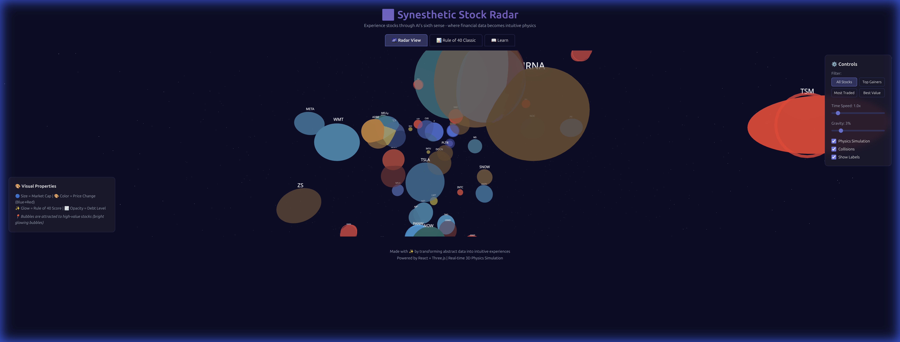
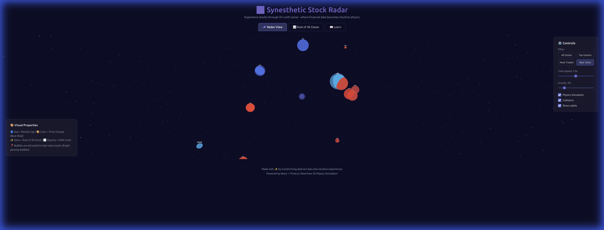
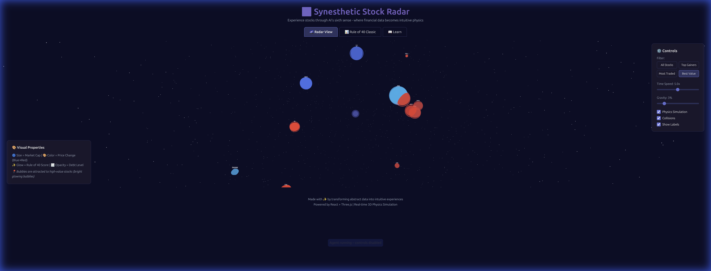
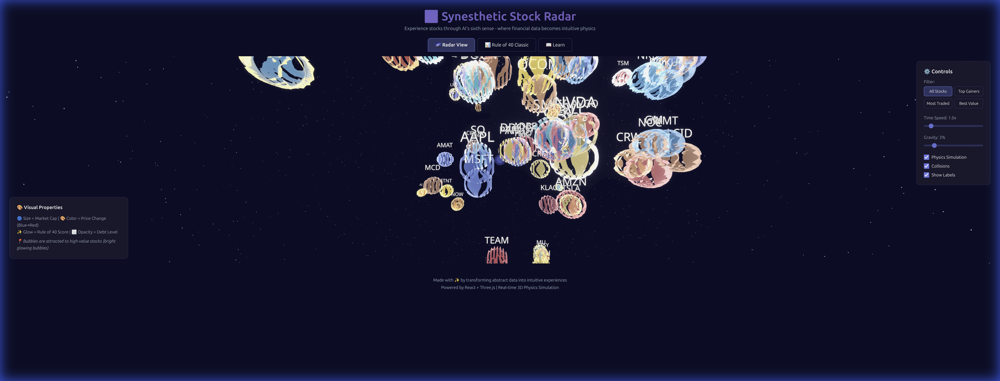

# Synesthetic Stock Radar - Walkthrough

## Overview
We have successfully rebuilt the Synesthetic Stock Radar using React + Three.js! The application now features a performant 3D physics engine, interactive controls, and a premium dark space theme.

## ✅ Completed Features

### 1. 3D Radar View
- **Real-time Physics**: 60 FPS simulation with gravity, collision detection, and damping.
- **Visual Mappings**:
  - **Size**: Market Cap (logarithmic)
  - **Color**: Price Change (Blue/Red gradient)
  - **Glow**: Rule of 40 Score
  - **Opacity**: Debt Level
- **Interactive Controls**:
  - Orbit & Zoom camera
  - Time Speed Slider (0.1x - 10x)
  - Gravity Strength
  - Filters (Top Gainers, Best Value)

### 2. Rule of 40 Classic View
- 2D Scatter plot implementation.
- Visualizes Operating Margin vs. Revenue Growth.
- Dashed "Rule of 40" frontier line.

### 3. Learn Tab
- Educational content carousel.
- Chapter navigation with smooth transitions.
- Ported original Chinese content.

### 4. Interactive Features
- **Hover Tooltips**: Detailed stock information on hover.
- **Control Panel**: Glassmorphism UI for settings.

### 5. Visual Enhancements
- **Custom Shaders**: Implemented `BubbleShaderMaterial` with Fresnel effect and dynamic glow.
- **Glassmorphism**: Bubbles now have a premium glass-like appearance.
- **HTML Tooltips**: Rich HTML overlays with backdrop blur.

## 🛠️ Technical Implementation
- **Frontend**: React, Vite, TypeScript
- **3D Engine**: React Three Fiber, Three.js
- **State**: Zustand
- **Backend**: Express.js (Mock API with caching)
- **Styling**: Vanilla CSS with Glassmorphism

## 🔜 Next Steps
- **Advanced Shaders**: Implement custom GLSL shaders for "glass" bubbles.
- **Sector Clustering**: Group stocks by sector in 3D space.
- **Heat Map**: Volume-based visual overlay.
